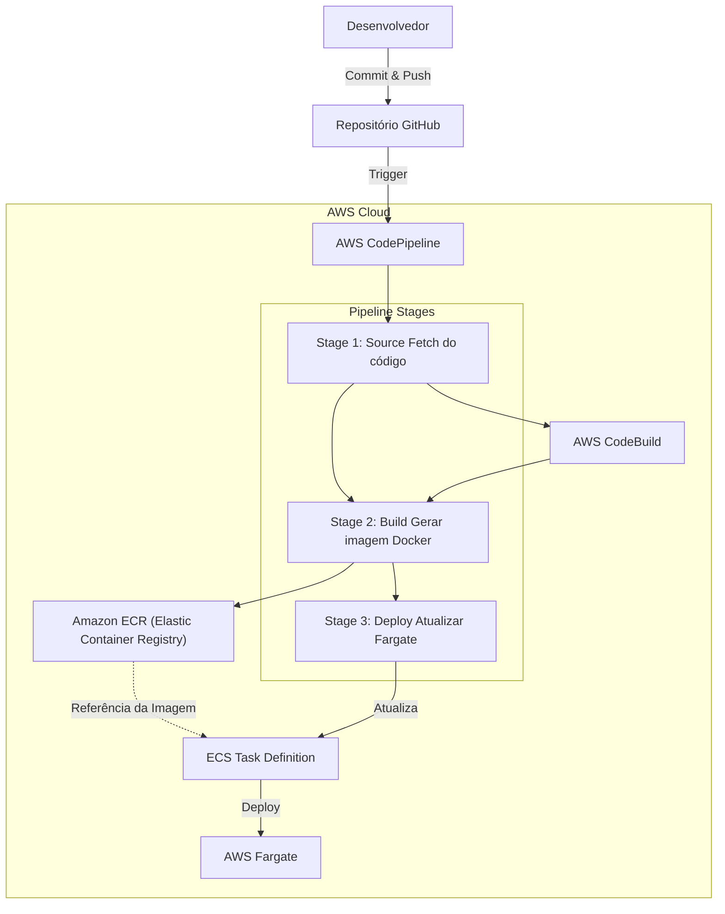

```mermaid
flowchart TB
    Developer["Desenvolvedor"] -->|Commit & Push| GitRepo["Repositório GitHub"]
    

        direction TB
        GitRepo -->|Trigger| Pipeline["AWS CodePipeline"]
    subgraph "AWS Cloud"        
        subgraph "Pipeline Stages"
            direction LR
            Stage1["Stage 1: Source Fetch do código"] --> Stage2["Stage 2: Build Gerar imagem Docker"]
            Stage2 --> Stage3["Stage 3: Deploy Atualizar Fargate"]
        end
        
        Pipeline --> Stage1
        
        Stage1 --> CodeBuild["AWS CodeBuild"]
        CodeBuild --> Stage2
        
        Stage2 --> ECR["Amazon ECR (Elastic Container Registry)"]
        
        ECR -.->|Referência da Imagem| TaskDef["ECS Task Definition"]
        Stage3 -->|Atualiza| TaskDef
        
        TaskDef -->|Deploy| Fargate["AWS Fargate"]
    end

```

